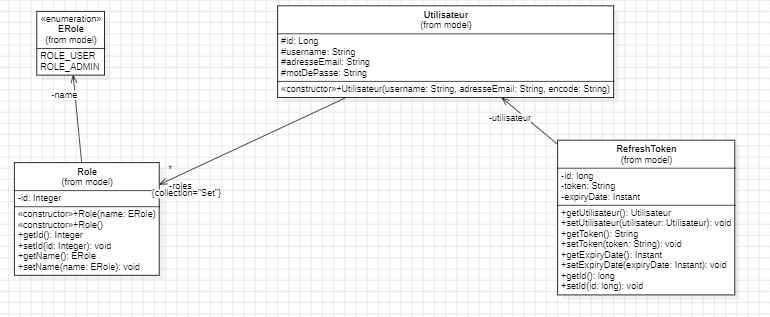
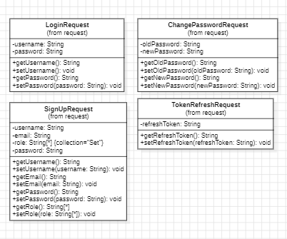
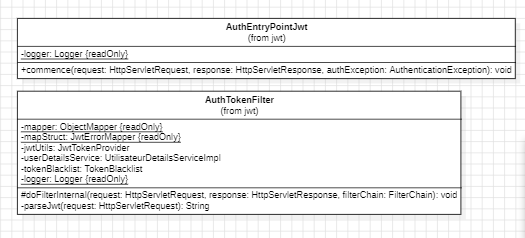

# Projet API d'Authentification et de Gestion des Utilisateurs

Ce projet est une API RESTful développée avec Spring Boot pour gérer l'authentification et la gestion des utilisateurs, incluant des fonctionnalités d'inscription, de connexion, de vérification de token, de changement de mot de passe, et plus encore.

## Table des matières

- [Technologies](#technologies)
- [Installation](#installation)
- [Structure du Projet](#structure-du-projet)
- [Fonctionnalités](#fonctionnalités)
- [Endpoints API](#endpoints-api)
- [Contribuer](#contribuer)
- [License](#license)

## Technologies

- Spring Boot
- Spring Security
- JWT (JSON Web Token)
- Maven

## Installation

1. Clonez le dépôt :
   ```bash
   git clone https://github.com/votre-repo/projet-api.git
2. Accédez au répertoire du projet :
    ```bash
    cd projet-api
3. Compilez et démarrez le projet avec Maven :
    ```bash
    mvn spring-boot:run
   
## Structure du Projet

Le projet est structuré conformément à l'architecture hexagonale (ports et adaptateurs) et suit les principes de conception SOLID. Voici un aperçu de la structure du projet :

```css
src/
├── main/
│   ├── java/
│   │   └── fr/
│   │       └── esgi/
│   │           └── User_Task/
│   │               ├── application/
│   │               │   ├── advice/
│   │               │   │   ├── ErrorMessage.java
│   │               │   │   ├── TokenControllerAdvice.java
│   │               │   ├── configuration/
│   │               │   │   ├── SecurityConfig.java
│   │               │   ├── controller/
│   │               │   │   ├── ControllerAdvice.java
│   │               │   │   ├── UtilisateurController.java
│   │               │   │   ├── VerifyController.java
│   │               │   ├── exception/
│   │               │   │   ├── CustomExpiredJwtTokenException.java
│   │               │   │   ├── CustomMalformedJwtTokenException.java
│   │               │   │   ├── CustomTechnicalJwtException.java
│   │               │   │   ├── TokenRefreshException.java
│   │               │   ├── hexa/
│   │               │   │   ├── domain/
│   │               │   │   │   ├── api/
│   │               │   │   │   │   ├── IService.java
│   │               │   │   │   │   ├── TestService.java
│   │               │   │   │   ├── persistence/
│   │               │   │   │   │   ├── adapter/
│   │               │   │   │   │   │   ├── UtilisateurDao.java
│   │               │   │   │   ├── spi/
│   │               │   │   │   │   ├── IDao.java
│   │               │   │   │   ├── Test.java
│   │               │   ├── mapper/
│   │               │   │   ├── JwtErrorMapper.java
│   │               │   ├── model/
│   │               │   │   ├── Erole.java
│   │               │   │   ├── RefreshToken.java
│   │               │   │   ├── Role.java
│   │               │   │   ├── Utilisateur.java
│   │               │   ├── payload/
│   │               │   │   ├── request
│   │               │   │   │   ├── SignUpRequest.java
│   │               │   │   │   ├── TokenRefreshRequest.java
│   │               │   │   │   ├── ChangePasswordRequest.java
│   │               │   │   │   ├── LoginRequest.java
│   │               │   │   ├── response
│   │               │   │   │   ├── JwtResponse.java
│   │               │   │   │   ├── MessageResponse.java
│   │               │   │   │   ├── TokenRefreshResponse.java
│   │               │   │   │   ├── JwtErrorDTO.java
│   │               │   ├── repository/
│   │               │   │   ├── RefreshTokenRepository.java
│   │               │   │   ├── RoleRepository.java
│   │               │   │   ├── UtilisateurRepository.java
│   │               │   ├── security/
│   │               │   │   ├── jwt/
│   │               │   │   │   ├── AuthEntryPointJwt.java
│   │               │   │   │   ├── AuthTokenFilter.java
│   │               │   │   │   ├── JwtTokenProvider.java
│   │               │   │   ├── service/
│   │               │   │   │   ├── impl/
│   │               │   │   │   │   ├── UtilisateurDetailsServiceImpl.java
│   │               │   │   │   │   ├── UtilisateurDetailsImpl.java
│   │               │   │   │   ├── RefreshTokenService.java
│   │               │   │   │   ├── TokenBlacklist.java
│   │               ├── AuthentificationApplication.java 
└── resources/
    └── application.properties
```

## Fonctionnalités

### Authentification
- Inscription : Permet à un nouvel utilisateur de s'inscrire.
- Connexion : Permet à un utilisateur existant de se connecter.
- Vérification de Token : Vérifie la validité des tokens JWT.
- Rafraîchissement de Token : Permet de rafraîchir les tokens JWT expirés.
- Changement de Mot de Passe : Permet à un utilisateur de changer son mot de passe.

### Gestion des Utilisateurs
- Ajouter un Utilisateur : Permet d'ajouter un nouvel utilisateur.
- Récupérer un Utilisateur : Permet de récupérer les détails d'un utilisateur.
- Mettre à Jour un Utilisateur : Permet de mettre à jour les informations d'un utilisateur.
- Supprimer un Utilisateur : Permet de supprimer un utilisateur.

## Endpoints API
### Authentification
- POST /api/auth/signup : Inscription d'un nouvel utilisateur.
- POST /api/auth/login : Connexion d'un utilisateur existant.
- POST /api/auth/refreshtoken : Rafraîchissement du token JWT.
- POST /api/auth/changepassword : Changement de mot de passe.
### Gestion des Utilisateurs
- POST /api/utilisateur/nouveau-utilisateur : Ajouter un nouvel utilisateur.
- GET /api/utilisateur/get-utilisateur-by-id : Récupérer un utilisateur par son ID.
- PUT /api/utilisateur/modifie-utilisateur : Mettre à jour les informations d'un utilisateur.
- DELETE /api/utilisateur/supprimer-utilisateur : Supprimer un utilisateur.

### Vérification de Token
- GET /api/verify : Vérifier la validité du token JWT.

## Ressources 



